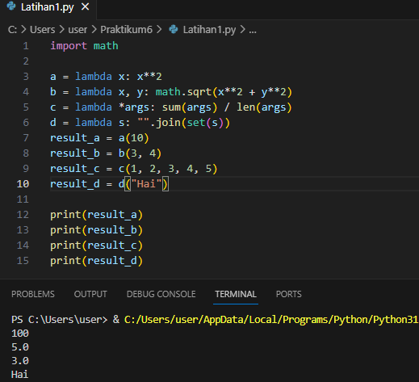
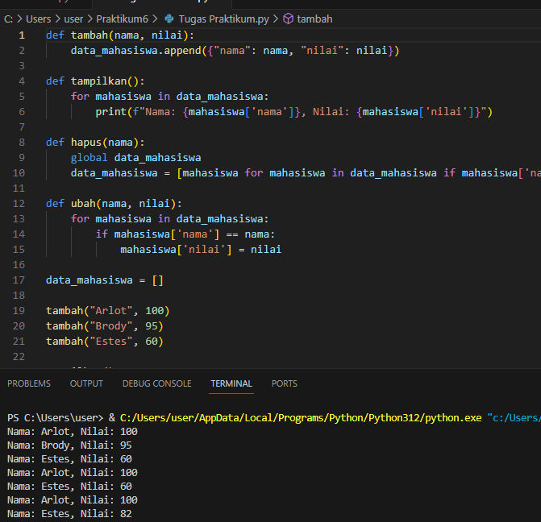

# Praktikum_7
# SUB RUTIN & FUNGSI

## Latihan 1

1. import math: Mengimpor modul math, yang menyediakan fungsi-fungsi matematika lebih lanjut, seperti fungsi akar kuadrat (sqrt).
2. a = lambda x: x**2: Membuat fungsi lambda dengan satu parameter x yang mengembalikan kuadrat dari x. Fungsi ini disimpan dalam variabel a.
3. b = lambda x, y: math.sqrt(x**2 + y**2): Membuat fungsi lambda dengan dua parameter x dan y yang mengembalikan nilai akar kuadrat dari jumlah kuadrat x dan y. Fungsi ini menggunakan fungsi sqrt dari modul math dan disimpan dalam variabel b.
4. c = lambda *args: sum(args) / len(args): Membuat fungsi lambda dengan parameter *args, yang dapat menerima sejumlah argumen. Fungsi ini mengembalikan rata-rata dari semua argumen yang diterima.
5. d = lambda s: "".join(set(s)): Membuat fungsi lambda dengan satu parameter s yang mengembalikan string baru yang berisi karakter unik dari string s, menggunakan fungsi set dan join.
6. result_a = a(10): Memanggil fungsi a dengan argumen 10 dan menyimpan hasilnya dalam variabel result_a.
7. result_b = b(3, 4): Memanggil fungsi b dengan argumen 3 dan 4, yang akan menghitung panjang hipotenusa segitiga dengan sisi-sisi 3 dan 4, dan menyimpan hasilnya dalam variabel result_b.
8. result_c = c(1, 2, 3, 4, 5): Memanggil fungsi c dengan lima argumen dan menyimpan hasilnya dalam variabel result_c.
9. result_d = d("Hai"): Memanggil fungsi d dengan argumen "Hai" dan menyimpan hasilnya dalam variabel result_d.
10. print(result_a), print(result_b), print(result_c), dan print(result_d): Mencetak hasil dari masing-masing pemanggilan fungsi di atas.

## OUTPUT

## Tugas_Praktikum 
Subrutin:
- Subrutin adalah bagian kecil dari program yang dapat dipanggil untuk melakukan tugas tertentu.
- Digunakan untuk mengorganisir dan memecah program menjadi bagian-bagian yang lebih kecil dan mudah dikelola.
- Biasanya dipanggil dari bagian utama program (main program) dan dapat mengembalikan hasil ke pemanggilnya.
- Meningkatkan keterbacaan dan perawatan program.
Fungsi:
- Fungsi adalah blok kode yang dirancang untuk melakukan tugas tertentu dan dapat dipanggil dari bagian manapun dalam program.
- Sama seperti subrutin, fungsi membantu dalam memecah program menjadi bagian-bagian yang lebih kecil dan terorganisir.
- Fungsi dapat mengembalikan nilai kepada pemanggilnya.
- Meningkatkan modularitas dan reusabilitas kode

## Description
tambah(nama, nilai): Menambahkan data mahasiswa baru ke dalam list data_mahasiswa dengan format dictionary yang berisi nama dan nilai mahasiswa.

tampilkan(): Mencetak semua data mahasiswa yang ada dalam list data_mahasiswa dengan format tertentu.

hapus(nama): Menghapus data mahasiswa berdasarkan nama yang diberikan dari list data_mahasiswa.

ubah(nama, nilai): Mengubah nilai mahasiswa berdasarkan nama yang diberikan di dalam list data_mahasiswa.

data_mahasiswa: List yang digunakan untuk menyimpan data mahasiswa.

## OUTPUT

## Features

If your project has a lot of features, list them here.

## Tests
1. Fungsi tambah(nama, nilai):
2. Menambahkan data mahasiswa baru ke dalam data_mahasiswa.
3. Fungsi tampilkan():
3. Menampilkan nama dan nilai mahasiswa yang ada dalam data_mahasiswa.
4. Fungsi hapus(nama):Menghapus data mahasiswa berdasarkan nama dari data_mahasiswa.
5. Fungsi ubah(nama, nilai):Mengubah nilai mahasiswa berdasarkan nama dalam data_mahasiswa.
6. Variabel data_mahasiswa:Menyimpan daftar mahasiswa beserta nilai mereka.
7. Pemanggilan Fungsi:Menambahkan beberapa mahasiswa ke dalam data_mahasiswa menggunakan fungsi tambah.Menampilkan data mahasiswa menggunakan fungsi tampilkan.Menghapus        mahasiswa "Bob" menggunakan fungsi hapus.Menampilkan data mahasiswa kembali.Mengubah nilai mahasiswa "Charlie" menggunakan fungsi ubah.Menampilkan data mahasiswa            setelahperubahan.Penggunaan List Comprehension:Fungsi hapus menggunakan list comprehension untuk menghasilkan list baru tanpa data mahasiswa yang dihapus.
8. Penggunaan Global Keyword:Fungsi hapus menggunakan kata kunci global untuk memodifikasi variabel data_mahasiswa di luar fungsi.